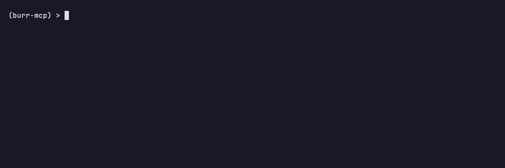

# BurrMCP

[](https://pypi.org/project/burrmcp/)
[](https://pypi.org/project/burrmcp/)
[](LICENSE)
[](https://msradam.github.io/burrmcp/)
[](https://github.com/apache/burr)
[](https://github.com/jlowin/fastmcp)

BurrMCP gives an AI agent a stateful, auditable workflow it cannot step outside of. You define the workflow as a [Burr](https://burr.dagworks.io/) state machine; BurrMCP serves it over [MCP](https://modelcontextprotocol.io/) so the agent advances it one transition at a time.

Each Burr `@action` is reachable through one `step(action, inputs)` MCP tool. State lives on the server. The server enforces transitions: if the agent calls an action that isn't reachable from the current state, the response is a structured refusal listing the actions that are reachable. Every step is recorded to a replayable trace.


```python
from burrmcp import mount

server = mount(application)
server.run()
```

Full documentation: [msradam.github.io/burrmcp](https://msradam.github.io/burrmcp/).

## Install

```bash
uv pip install burrmcp     # or: pip install burrmcp
```

From source:

```bash
git clone git@github.com:msradam/burrmcp.git
cd burrmcp
uv sync
```

Python 3.11 through 3.13. Optional extras: `burrmcp[observability]` (OpenTelemetry), `burrmcp[ui]` (Burr web UI), `burrmcp[all]`.

## Quickstart

Build a Burr graph, mount it, point an agent at it.

```python
from burr.core import action, ApplicationBuilder, State
from burrmcp import mount, ServingMode

@action(reads=[], writes=["stage", "item", "qty"])
def take_order(state: State, item: str, qty: int = 1) -> State:
    """Place a new coffee order."""
    return state.update(stage="ordered", item=item, qty=qty)

@action(reads=["stage"], writes=["stage", "paid_amount"])
def pay(state: State, amount: float) -> State:
    """Pay for the placed order."""
    return state.update(stage="paid", paid_amount=amount)

@action(reads=["stage"], writes=["stage"])
def fulfill(state: State) -> State:
    """Mark the order fulfilled. Terminal."""
    return state.update(stage="fulfilled")

app = (
    ApplicationBuilder()
    .with_actions(take_order=take_order, pay=pay, fulfill=fulfill)
    .with_transitions(("take_order", "pay"), ("pay", "fulfill"))
    .with_state(stage="new")
    .with_entrypoint("take_order")
    .build()
)

mount(app, mode=ServingMode.STEP, name="coffee").run()
```

A client that calls `pay` before `take_order` gets a structured refusal:

```json
{
  "error": "invalid_transition",
  "valid_next_actions": ["take_order"],
  "message": "action 'pay' is not reachable from current state. Valid actions now: ['take_order']."
}
```

The list of valid actions rides on the response, so a client without its own model of the graph recovers from a single error. The shipped `examples/coffee_order.py` extends this with an `add_modifier` loop and a `cancel` escape, demonstrating loop, branch, and escape on top of the linear path.

## Why this shape

The four-tool surface (`step`, `reset_session`, `fork_at`, `fork_from_past`) is constant regardless of FSM complexity. The agent reads the action namespace from `burr://graph`, calls `step(action=X)`, and the server refuses anything not reachable from the current state. The reachable action set is the graph, enforced at the protocol layer rather than asked of the model. See [Architecture](https://msradam.github.io/burrmcp/architecture/).

The integration boundary is Burr's `Application`: anything `ApplicationBuilder` supports (parallelism, persistence, typed state, hooks, telemetry, sub-applications) passes through `mount()` without adapter changes. See [What works through mount()](https://msradam.github.io/burrmcp/compatibility/).

## Observability

Add a tracker to the builder and every step is recorded to JSONL and replayable in the Burr UI:

```python
from burr.tracking.client import LocalTrackingClient

app = ApplicationBuilder().with_tracker(LocalTrackingClient(project="coffee-demo"))  # ...
```


The agent reads its own audit trail through `burr://` resources (`graph`, `state`, `next`, `history`, `trace`, `session`, `subruns`). From the terminal, the CLI reads the same tracker store:

```bash
burrmcp sessions ls                 # recent sessions
burrmcp sessions show <app-id>      # full timeline: per-step state diff + timing
burrmcp watch [app-id]              # live-tail a running session
burrmcp logs --refusals --plain     # only steps that errored, pipe-friendly
```



Full surface (resources, CLI, UI, OpenTelemetry): [Observability](https://msradam.github.io/burrmcp/observability/).

## Driving other MCP servers

A Burr action can call tools on *other* MCP servers through BurrMCP. Pass `mount(application, upstream={...})` a map of server name to a `fastmcp.Client` transport; inside an action body, `call_upstream(server, tool, args)` forwards to it.

```python
from burrmcp import call_upstream, mount

@action(reads=[], writes=["pods"])
async def survey(state):
    pods = await call_upstream("k8s", "list_pods", {"namespace": "prod"})
    return state.update(pods=pods)

server = mount(build_application, upstream={"k8s": {"command": "npx", "args": ["-y", "kubernetes-mcp-server"]}})
```

The agent connects to one server (this one) and sees one tool (`step`). The upstream servers are reached from inside actions, so every upstream call advances state. See [Driving other MCP servers](https://msradam.github.io/burrmcp/upstream/).

## Shipping your own command

A package that ships an MCP graph can expose its own command with `build_cli`, baking in the graph so `serve` needs no target:

```python
# my_fsm_mcp/cli.py
from burrmcp.cli import build_cli, run
from my_fsm_mcp import build_application

cli = build_cli("my-fsm-mcp", application=build_application, help="My graph as an MCP server.")

def main() -> int:
    return run(cli)
```

Then `my-fsm-mcp serve`, `my-fsm-mcp doctor`, and `my-fsm-mcp sessions ls` all carry your name. See [CLI](https://msradam.github.io/burrmcp/cli/).

## Examples

`examples/` ships self-contained FSMs, each runnable as `uv run python examples/<file>.py` and wireable into a client via the shipped `examples/*.example.json` configs.

- **Pure FSM**: `coffee_order`, `triage`, `adventure`, `chargen`, `incident_response`, `local_shell`, `ml_training`, `subgraphs`.
- **Typed state, hooks, persistence**: `typed_state_loan`, `pydantic_actions`, `pipeline_hooks`, `async_hooks`, `streaming_hooks`, `sqlite_persister`, `async_persister`, `state_forking`.
- **Shellout / real tooling**: `unix_health`, `codebase_security`, `git_review`.
- **LLM-in-the-graph (local model runtime)**: `granite_oncall`, `adaptive_crag`, `granite_guardian`, `mellea_qiskit_migration`.
- **Caller-LLM / user-in-the-loop**: `caller_sample`, `elicit_confirm`.
- **Observability**: `with_otel`, `custom_telemetry`, `trace_decorator`, `full_logger`, `with_middleware`.
- **SKILL-to-FSM**: `security_audit`, `differential_review`, `fp_check`, `webapp_testing`.
- **Upstream**: `upstream_filesystem` drives the official filesystem MCP server.

Some demos need a runtime (Ollama with a Granite model; `bandit` / `detect-secrets` on PATH; a git repo). Each refuses at action time with a clear message when its runtime is missing.

## Validate before mounting

```bash
burrmcp doctor module:attr            # static validation
burrmcp doctor module:attr --runtime  # also probe the mounted wire shape
```

`doctor` exits nonzero on failures, so it slots into CI. Importable too: `from burrmcp.doctor import run_checks`.

## Tests

```bash
uv run pytest
```

Six hundred and thirty-one tests, most in-process via FastMCP's in-memory client. `tests/smoke/` holds opt-in real-Claude tests (deselected by default).

## Acknowledgements

BurrMCP is glue between two libraries that do the hard parts:

- [Apache Burr](https://github.com/apache/burr) provides the state-machine `Application`, the transition graph, and the `LocalTrackingClient` / Burr UI replay.
- [FastMCP](https://github.com/jlowin/fastmcp) provides the MCP server, the resource and tool transforms, and the client used by the `upstream` feature.

The SKILL demos under `examples/skills/` are reproduced verbatim from Anthropic and Trail of Bits with attribution in each file.

BurrMCP is an independent project. It is not affiliated with, endorsed by, or sponsored by the Apache Software Foundation, DAGWorks, the Apache Burr project, or the FastMCP project. "Apache Burr" and "FastMCP" are the property of their respective owners and are referenced here only to describe what BurrMCP builds on.

## License

Apache 2.0.

## Notice

BurrMCP is independent open-source work by Adam Munawar Rahman and does not represent the views, positions, or technology roadmap of IBM Corporation or any other employer. See [NOTICE.md](NOTICE.md).
