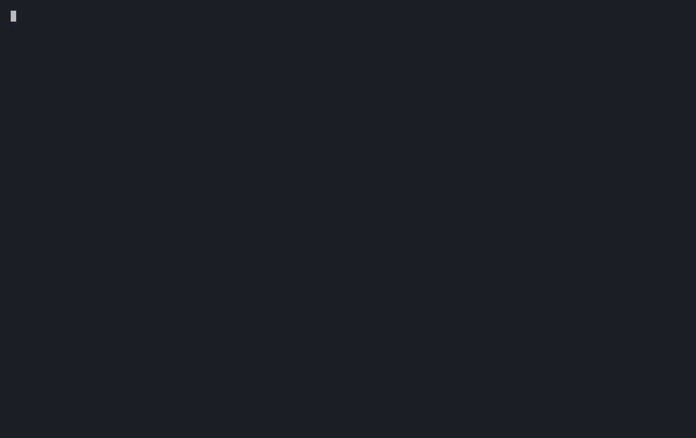
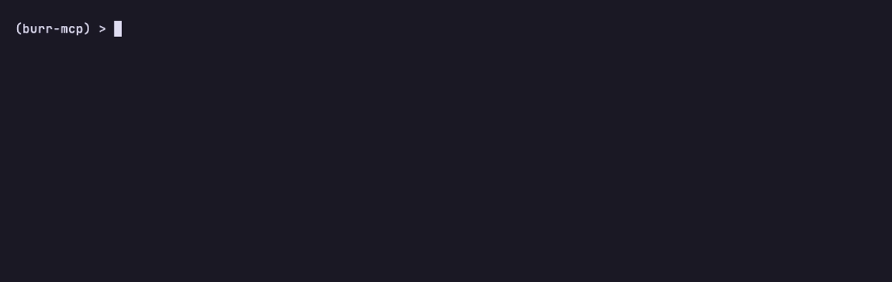

# Theodosia

[](https://pypi.org/project/theodosia/)
[](https://github.com/msradam/theodosia/actions/workflows/ci.yml)
[](LICENSE)
[](https://msradam.github.io/theodosia/)
[](https://github.com/apache/burr)
[](https://github.com/jlowin/fastmcp)

**Theodosia puts an AI agent on rails.** You define a workflow once as a [Burr](https://burr.dagworks.io/) state machine, and Theodosia serves it over [MCP](https://modelcontextprotocol.io/) so the agent can only take the next allowed step, with every step recorded and replayable. The model can be wrong; the model cannot lie about state.


*An open 1T-parameter model (Kimi K2.6) investigating a live incident on rails: each Grafana query is recorded as evidence, out-of-phase calls are refused, and the conclusion stays gated until the evidence cross-references. The investigation FSM ([Phoebe](https://github.com/msradam/phoebe)) is the workflow; Theodosia is what makes the model drive it.*

| What you get | Why it holds |
|---|---|
| **Stays on the rails** | The server enforces the graph. An unreachable action returns a structured refusal listing the ones that are reachable, and the agent self-corrects from it. |
| **Auditable by default** | Every step, its inputs, the state change, refusals, and timing are recorded to a replayable trace through Burr's tracker and UI. |
| **One portable contract** | Drive the same graph from your own Python or hand it to an external LLM over MCP. The workflow is a versioned artifact, not tied to either. |
| **Built on mature parts** | Apache Burr is the workflow engine; FastMCP is the MCP layer. Theodosia is the thin layer that makes one drive the other. |

---

## Why this shape works

LLM agents fail at procedural work in predictable ways: they skip steps, stop too early or not at all, and declare success without verifying. IBM Research found prompt-level fixes buy about 15.6%, a state machine to enforce termination up to 53%, and [recommends finite state machines outright](https://huggingface.co/blog/ibm-research/itbenchandmast). Theodosia is that state machine, served over the wire. It removes the structural failures, not reasoning errors inside a valid step: the agent keeps its full toolset (including other MCP servers via `upstream`) and chooses freely within each step.

More: [IBM IT-Bench + MAST](https://huggingface.co/blog/ibm-research/itbenchandmast) · [MAST, UC Berkeley](https://arxiv.org/abs/2503.13657) · [Microsoft AIOpsLab](https://www.microsoft.com/en-us/research/blog/aiopslab-building-ai-agents-for-autonomous-clouds/) · [Grafana o11y-bench](https://o11ybench.ai/)

### What the rails do, shown

The clearest evidence is a [case study](https://msradam.github.io/theodosia/case-study/):
the same model (Kimi K2.6) on the same [o11y-bench](https://o11ybench.ai/) incident
tasks, run free-ranging with the raw Grafana toolset versus on rails through
[Phoebe](https://github.com/msradam/phoebe). Free-ranging, it repeatedly
investigated and then never produced an answer. On rails, the `conclude` gate
forced it to commit, and it reached the correct root cause. o11y-bench's own
grader is the witness, on one free-ranging run: *"There is no final response
message in the transcript, it ends with tool calls and thinking blocks."* Three
grader-verified pairs are in the [case study](https://msradam.github.io/theodosia/case-study/).

A full head-to-head aggregate on o11y-bench's 11-task investigation category is
still being finalized. A first complete run is in hand, but it used an earlier
Phoebe configuration that over-gated exploration (since fixed), so a clean re-run
is pending and no aggregate number is published until it lands. Treat the case
study as the load-bearing evidence; the aggregate is pending. The design
rationale (and what rails do not fix) is in the
[research foundation](https://msradam.github.io/theodosia/research-foundation/).

---

## Install

```bash
uv pip install theodosia     # or: pip install theodosia
```

Python 3.11 through 3.13. Optional extras: `theodosia[observability]`, `theodosia[ui]`, `theodosia[all]`.

---

## Quickstart

```python
from theodosia import mount

mount(application, name="coffee").run()   # `application` is any Burr Application
```

A client that calls `pay` before `take_order` gets a refusal it can recover from: the valid actions ride on every response.

```json
{ "error": "invalid_transition", "valid_next_actions": ["take_order"] }
```

A smaller example, the same mechanism: an agent ordering coffee, refused when it tries to pay before ordering and recovering from the refusal.



---

## Command line

```bash
theodosia serve module:app      # mount a Burr graph as an MCP server
theodosia render module:app     # draw the state machine in the terminal (--mermaid / --dot)
theodosia doctor module:app     # statically validate the graph; exits nonzero for CI
theodosia sessions show <id>    # full timeline: per-step state diff + timing
theodosia watch                 # live-tail a running session
theodosia logs --refusals       # only the steps that were refused
theodosia verify                # check the session's tamper-evident ledger
```

A downstream package can ship its own command (`my-fsm serve`, `my-fsm doctor`, ...) with `build_cli`.

---

## Observability

Every session is recorded through Burr's tracker. Tail a live run, replay a finished one step by step with its state diffs and timing, or open it in the Burr UI for the transition graph and state inspection. Refusals are recorded too: they appear in the timeline like any other step.



---

## Documentation

Full docs at **[msradam.github.io/theodosia](https://msradam.github.io/theodosia/)**.

| Section | What it covers |
|---|---|
| [Authoring a graph](https://msradam.github.io/theodosia/authoring/) | Build a Burr Application from scratch and serve it, with the traps newcomers hit |
| [Examples](https://msradam.github.io/theodosia/examples/) | Standalone agents built with Theodosia (Phoebe, triage, deploy-gate, coffee) and the in-repo FSMs |
| [Architecture](https://msradam.github.io/theodosia/architecture/) | The four-tool surface, structured refusals, how `mount()` drives Burr |
| [What works through mount()](https://msradam.github.io/theodosia/compatibility/) | Typed state, persistence, hooks, parallelism, sub-applications, telemetry |
| [Observability](https://msradam.github.io/theodosia/observability/) | The `theodosia://` resources, the CLI, the Burr UI, OpenTelemetry |
| [Security model](https://msradam.github.io/theodosia/security-model/) | The agent trust boundary: what Theodosia enforces, and what it does not |
| [Case study](https://msradam.github.io/theodosia/case-study/) | Same model, on rails vs free-ranging: where the rails make the agent finish, grader-verified |
| [Research foundation](https://msradam.github.io/theodosia/research-foundation/) | The published evidence behind the design, and what rails do not fix |
| [Driving other MCP servers](https://msradam.github.io/theodosia/upstream/) | `upstream`: a Burr action calling tools on other MCP servers |
| [CLI](https://msradam.github.io/theodosia/cli/) | `serve` / `doctor` / `render` / `sessions` / `watch` / `logs`, and `build_cli` |

---

## Agents built with Theodosia

Standalone repositories, each a real agent you can clone and run:

| Repo | What it is |
|---|---|
| [Phoebe](https://github.com/msradam/phoebe) | SRE incident-investigation FSM (the hero above). Keeps the full Grafana toolset; the FSM gates the procedure and the audit trail. Ships a Harbor agent for Grafana's o11y-bench. |
| [triage-agent](https://github.com/msradam/triage-agent) | Support triage: investigate before you decide, enforced by the graph. |
| [deploy-gate-agent](https://github.com/msradam/deploy-gate-agent) | A change/deploy gate: ordered gates, a health gate, an audit trail, and a call out to a filesystem MCP server via `upstream`. |
| [coffee-agent](https://github.com/msradam/coffee-agent) | The toy: a coffee-order state machine an LLM drives one enforced step at a time. |

## Examples and tests

[`examples/`](examples/) ships self-contained FSMs (pure-FSM, typed state, hooks, persistence, real shellouts, LLM-in-the-graph, SKILL-to-FSM, upstream, multi-graph), each runnable with `uv run python examples/<file>.py`. Run the suite with `uv run pytest`.

---

## Acknowledgements

Theodosia is glue between two libraries that do the hard parts: [Apache Burr](https://github.com/apache/burr) provides the state-machine `Application`, the transition graph, and the tracking UI; [FastMCP](https://github.com/jlowin/fastmcp) provides the MCP server, the transforms, and the client behind `upstream`. The SKILL demos under `examples/skills/` are reproduced verbatim from Anthropic and Trail of Bits with attribution.

On the name: Theodosia was Aaron Burr's daughter, known for her correspondence with him. The project sits in the same family as Burr and reaches it, which is the role it plays here.

Theodosia is an independent project, not affiliated with or endorsed by the Apache Software Foundation, DAGWorks, the Apache Burr project, or FastMCP.

## License and notice

Apache 2.0. Theodosia is independent open-source work by Adam Munawar Rahman and does not represent the views of IBM Corporation or any other employer. See [NOTICE.md](NOTICE.md).
