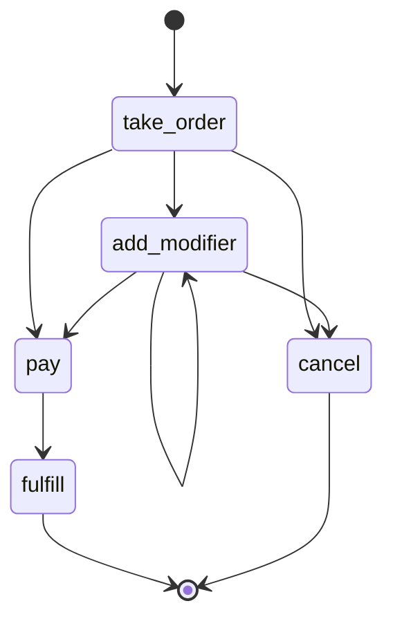

What `mount()` actually does, and the four MCP tools it always registers.

## The graph is the contract

The agent can only move along the graph's edges; the server refuses any step that
is not a reachable transition. The workflow lives in the state machine, not in a
prompt the model has to remember. `theodosia render <target>` prints this graph in
the terminal (or `--mermaid` / `--dot` for docs):



## The four-tool surface

Every server mounted in STEP mode registers the same tools regardless of how
complex the FSM is:

- `step(action, inputs)` runs one transition. Annotated
  `destructiveHint=True, idempotentHint=False`.
- `reset_session()` rebuilds this session's Application from the factory.
  Annotated `destructiveHint=True, idempotentHint=True`.
- `fork_at(sequence_id)` rolls this session back to a prior history entry.
  Annotated `destructiveHint=True, openWorldHint=False`.
- `fork_from_past(app_id, sequence_id)` resumes another session's state through
  the persister. Hidden from the listing when no `state_loader` or
  `LocalTrackingClient` is wired, since it would only ever refuse. Annotated
  `destructiveHint=True, openWorldHint=True` because the source state lives
  outside this session's history.

The annotations are FastMCP `ToolAnnotations`; capable clients render the
right confirmations and recovery affordances per tool.

Plus two synthetic tools from FastMCP's `ResourcesAsTools` transform,
`list_resources()` and `read_resource(uri)` (both `readOnlyHint=True`), so
tools-only clients can reach the `theodosia://` resources without
`resources/read`.

The action namespace lives in `step`'s `action` argument schema and at
`theodosia://graph`, not in the tool listing. The listing stays compact; the agent
learns the verbs from the graph resource.

### The step response

`step` returns two content blocks: a short human-readable summary line (for
clients that render server logs inline, like `Step 3: verify_usage ✓ → resolve`)
and a structured JSON payload with the machine-readable result. A programmatic
client should read the structured payload (FastMCP exposes it as
`result.structured_content`, or the JSON block of `result.content`), not the
summary string. Both success and refusal come back on this same shape: a refusal
is `{"error": "invalid_transition", "valid_next_actions": [...], ...}`, an
action-body failure is `{"error": "action_error", "error_message": "..."}`.

## The action-selection trick

Burr's `astep` picks the next action via `app.get_next_action()`, which returns
the first transition whose condition is true. Under MCP the *client* named the
action to run. `_step_application` overrides `get_next_action` for the duration
of one step to return the client-named action, calls `astep`, then restores the
original. This is the bridge between MCP's "client chose X" semantics and
Burr's transition-condition semantics, and the only Burr internal Theodosia
touches.

Before running, the step checks reachability against the live transitions. An
unreachable action is refused with `invalid_transition` and the response carries
`valid_next_actions`, so a client without its own model of the graph can recover
from a single error.

## Per-session isolation

`mount(...)` accepts either an `Application` instance (shared state across all
sessions) or a callable factory (one Application per MCP session). The session
store is a plain dict keyed by `ctx.session_id`, held in `mount`'s closure
scope. Each entry holds the Application built lazily on first touch, a
per-session `asyncio.Lock`, and the history and subrun records.

Eviction is lazy: stale entries are dropped on the next access, not on a
background timer. `session_ttl_seconds` (default 3600) and `max_sessions`
(default 100) each cap the store; set either to `None` to disable that form of
eviction.

FastMCP's `ctx.set_state(serializable=False)` is request-scoped, not
session-scoped, so it is not suitable for caching the Application across calls in
one session. The closure dict is.

## What `mount()` accepts

```python
mount(
    application_or_factory,
    *,
    name="theodosia",
    instructions=None,
    hooks=[...],                    # Burr LifecycleAdapter list
    middleware=[...],               # FastMCP Middleware list
    upstream={"name": {...}},       # other MCP servers callable from action bodies
    personas=...,                   # PERSONA.md identity layer
    state_loader=...,               # for fork_from_past against a custom persister
    action_timeout_seconds=None,    # hard timeout per action
    session_ttl_seconds=3600,
    max_sessions=100,
)
```

`hooks` are attached via Burr's public `LifecycleAdapterSet.with_new_adapters`,
the same path Burr uses internally to wire its own `TracerFactoryContextHook`.
Hooks attached this way fire on the same surfaces as
`ApplicationBuilder.with_hooks(...)`.

`middleware` runs after Theodosia's built-in input-coercion middleware, so user
middleware (OpenTelemetry, rate limiting, structured logging) sees the
post-coercion tool arguments.

`upstream` opens an MCP *client* session to each named server and binds them so
action bodies can call their tools via `theodosia.call_upstream(server, tool,
args)`. The agent sees only `step`; the upstream servers are not in its tool
listing. Every upstream call advances state by construction because it runs
inside an action body. See [Driving other MCP servers](upstream.md).

`mount_multi(applications, hooks=[...], middleware=[...])` composes several
Burr Applications into one MCP server with FastMCP namespacing; the kwargs
forward to every sub-application's `mount()` call.

## Persistence: save + resume

Persistence splits into two primitives that take the same persister:

- `ApplicationBuilder.with_state_persister(persister)` is the *saver*. Burr's
  `PersisterHook` calls `persister.save(...)` after every step.
- `ApplicationBuilder.initialize_from(persister, resume_at_next_action=True,
  default_state={...}, default_entrypoint="...")` is the *loader*. At session
  start it tries to read the latest snapshot for the current `app_id` and
  resumes mid-walk; falls back to the defaults when no snapshot exists.

You need both for a true save-and-resume loop. The `fork_from_past` meta-tool
also reaches the loader, so an agent can resurrect any past session by
`(app_id, sequence_id)` without anything in the factory. See
`examples/sqlite_persister.py` for both factories side by side.

## Input coercion middleware

`mount()` builds the FastMCP server with `strict_input_validation=False` and
adds a middleware that, for any `tools/call`, parses JSON-string values into
objects when the tool's declared schema allows object or array. The `step`
tool's `inputs` parameter is typed `dict | str | None` so the advertised schema
includes `string` in its `anyOf`.

Both moves are needed for clients that validate outbound requests against the
advertised schema (so the schema must accept the string form) and serialize
nested-object arguments as JSON strings (so the middleware must coerce them
before the action body runs).

